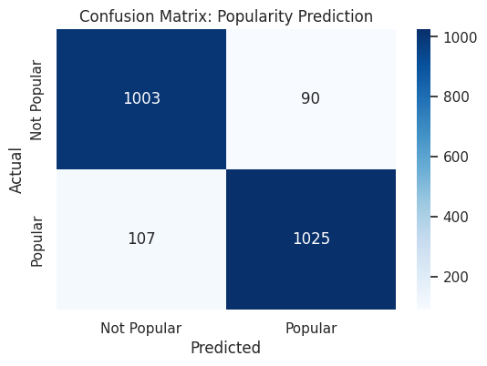

Book Popularity Predictor

Using Machine Learning techniques (Random Forest) we predict whether a book will become popular based on its metadata from the "Goodreads Books" dataset found on Kaggle: https://www.kaggle.com/datasets/jealousleopard/goodreadsbooks/data 

How to Run:

1. Prerequisites

Ensure you have Python installed and your virtual environment active.

Run this command on your project's terminal:
pip install -r requirements.txt

2. Setup Credentials

Create a .env file in the root directory and add your Kaggle credentials.

The inside of the file must look like this:
KAGGLE_USERNAME=your_username
KAGGLE_KEY=your_api_key

3. Train the Model

Run the training script to fetch the data and save the model.

Run this command on your project's terminal:
python train_model.py

4. Make Predictions

Use the interactive script to test your own book ideas.

Run this command on your project's terminal:
python predict.py

Methodology:

Dataset: "Goodreads Books" dataset via Kaggle.
Target Variable: is_popular (Binary classification based on the median number of ratings).
Features Used: average_rating, num_pages, language_code and text_reviews_count.
Model: RandomForestClassifier with 91% f1-score accuracy

Model Performance:

As shown in the Confusion Matrix (also found in the research_and_visuals.ipynb file), the model is well-balanced between predicting hits and average books:

Project Structure:

train_model.py: Automates data cleaning, encoding, and training.
book_popularity_model.pkl: The saved machine learning model.
predict.py: User interface for real-time predictions.
research_and_visuals.ipynb: Data analysis and evaluation.
.env: (Ignored by Git) Stores sensitive API keys.
.gitignore: Keeps the repository clean of junk files.